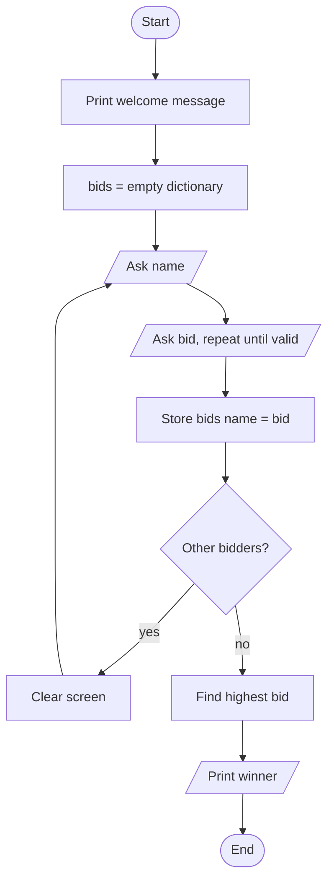

# Blind Auction Flowchart

Original chart: [diagrams.net](https://viewer.diagrams.net/?highlight=0000ff&edit=_blank&layers=1&nav=1&title=Blind%20Auction%20Flow%20Chart)

```mermaid
flowchart TD
    A([Start]) --> B[Print welcome message]
    B --> C[bids = empty dictionary]
    C --> D[/Ask name/]
    D --> E[/Ask bid, repeat until valid/]
    E --> F[Store bids name = bid]
    F --> G{Other bidders?}
    G -- yes --> H[Clear screen] --> D
    G -- no --> I[Find highest bid]
    I --> J[/Print winner/]
    J --> K([End])
```
